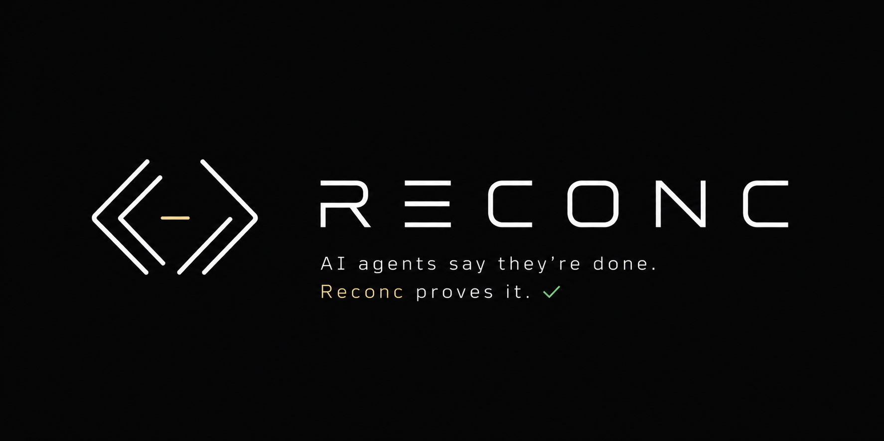

<p align="center">
  
</p>

# Reconc

**Evidence-bound completion control for AI coding agents.**

Reconc is a Repository Control Compiler: an offline, deterministic control and
evidence layer that turns project instructions into executable gates and
refuses completion until the repository, current evidence, and TASK state
agree.

[](https://github.com/Christopher-Schulze/reconc/actions/workflows/reconc-ci.yml)
[](https://go.dev/)
[](LICENSE)
[](#what-it-does)

[Demo](#see-the-real-loop-in-under-a-minute) · [Install](#install-and-bootstrap) · [Documentation](docs/documentation.md) · [Security](SECURITY.md) · [Contributing](CONTRIBUTING.md) · [Issues](https://github.com/Christopher-Schulze/reconc/issues/new/choose) · [Releases](https://github.com/Christopher-Schulze/reconc/releases)

An agent saying "done" is a claim. Reconc checks the work behind it: what the
agent read, changed, ran, proved, and completed. Missing tests, stale evidence,
protected edits, shipped-code stubs, documentation drift, incomplete TASKs,
and stuck loops become explicit repository decisions with one exact next
action.

AI-safety research calls the broader pattern reward hacking or specification
gaming when an agent satisfies a proxy or literal objective without achieving
the intended outcome. Reconc does not solve that general problem. It constrains
one concrete software-engineering slice: repository-local completion claims
that contradict current, configured evidence. The
[terminology, control map, and limits](docs/documentation.md#evidence-bound-completion-control)
are explicit.

- **Proof, not another opinion:** deterministic checks replace a second model
  judging the first model.
- **Repository-owned control:** policy compiles from `AGENTS.md`,
  `.reconc.yml`, presets, templates, and project files.
- **Agent-independent operation:** one contract spans nine registry-backed
  coding-agent integrations plus git pre-commit.
- **Bounded autonomy:** typed TASK state, durable run control, completion gates,
  and no-progress guards keep long agent runs on the rails.
- **Local by default:** one Go binary, with no daemon, Docker, model, or runtime
  network dependency.

## See the real loop in under a minute

With Reconc on `PATH`:

```bash
reconc demo
```

The demo creates an isolated Git repository, compiles real policy, blocks an
out-of-scope write and a source change without test proof, executes the real
test command, verifies an evidence-complete `done` report, and exports the same
candidate as a portable proof bundle. It uses no model
or network, cleans up by default, and emits inspectable proof with `--keep` or
`--json`.

```text
[BLOCK] out-of-scope write
[BLOCK] source change without current test proof
[REMEDIATE] one exact next action
[PASS] real test evidence bound to the changed state
[DONE] evidence-complete proof verified
[PROOF] portable JSON bundle verified
```

Install the checksummed, provenance-attested macOS or Linux release without
building:

```bash
curl -fsSL https://raw.githubusercontent.com/Christopher-Schulze/reconc/reconc-v0.8.6/install.sh \
  | RECONC_INSTALL_DIR="$HOME/.local/bin" sh -s -- 0.8.6
"$HOME/.local/bin/reconc" demo
```

On Windows x64, run the native PowerShell installer:

```powershell
$installer = Join-Path $env:TEMP "reconc-install.ps1"
Invoke-WebRequest https://raw.githubusercontent.com/Christopher-Schulze/reconc/main/install.ps1 -OutFile $installer
& $installer 0.8.6
Remove-Item $installer
& "$env:LOCALAPPDATA\Programs\Reconc\bin\reconc.exe" demo
```

## How Reconc Works

```text
AGENTS.md + .reconc.yml + presets + templates
                  |
                  v
        reconc refresh -> .reconc/policy.lock.json
                  |
                  v
     CLI checks + git hooks + agent runtime hooks
                  |
                  v
        pass / warn / block + exact next action
```

`reconc` does not make LLMs deterministic. It makes the boundary around their
work deterministic: which files are protected, which commands must have run,
which claims must be supplied, which hook events are allowed to continue, and
why a task is allowed to be called done.

## What It Does

| Control surface | What Reconc provides |
| --- | --- |
| Policy compiler | Compiles repository instructions, YAML policy, presets, templates, and provenance into a portable `.reconc/policy.lock.json`; stale locks, schema drift, invalid globs, unsupported rule kinds, and non-portable root markers fail closed. |
| Scope and change control | Records reads, writes, commands, claims, HEAD, index, and worktree state; policy can protect paths, require reads, forbid commands, couple related changes, and stop out-of-scope edits or deletions at supported boundaries. |
| Verification and completion | Binds successful command evidence to the repository state it verified; `reconc done .` checks current policy, Git state, reports, unresolved blocks, staged proofs, and typed TASK completion before accepting "done"; `reconc proof .` exports that candidate as shareable JSON or Markdown without private session data. |
| Source and repository assurance | Runs bounded native gates for layout, language boundaries, dependency pins, declared package scripts, formatting, source hygiene, network/process boundaries, substantive proof, and live verification. |
| Stub and drift detection | Detects leading `TODO`, `FIXME`, `STUB`, and `PLACEHOLDER` debt plus ignored Go errors, Rust `todo!()`/`unimplemented!()`, and common unimplemented throws in changed shipped source; `docs-sync` can require matching documentation updates. |
| TASK and context continuity | Validates and mutates a typed TASK lifecycle with recoverable claim, block, resume, split, promotion, and archive transitions; `session-briefing` supplies bounded machine-readable reentry context. |
| Autonomous run control | `reconc run on|off|reset|status|log` provides one durable repository switch, bounded decision logs, terminal completion checks, and per-session no-progress guards. |
| Bootstrap and adoption | Inspects an existing repository, proposes only evidence-backed packs and commands, then plans, applies, verifies, or removes a transactional rollout without overwriting drift. |
| Runtime enforcement | Generates, installs, inspects, and safely removes registry-backed hooks for nine coding-agent runtimes, with capability-specific failure semantics and git pre-commit as the repository backstop. |
| Operator and CI tooling | Includes exact remediation, policy explanation, staged evidence execution, CI proofs, audit tail/stats/export, deep doctor checks, a terminal dashboard, pruning, shell completions, and a generated manpage. |
| Release trust | Publishes checksums, build-provenance attestations, and deterministic SPDX 2.3 and CycloneDX 1.6 SBOMs tied to the full release commit. |

## Stack-aware assurance packs

Reconc ships 18 opt-in assurance packs. Detection can recommend a pack, but
Reconc never enables one silently, installs a toolchain, or invents a test,
lint, build, or typecheck command that the repository does not declare.

| Surface | Shipped packs |
| --- | --- |
| Languages | `go-assurance` · `rust-assurance` · `python-assurance` · `java-assurance` · `csharp-assurance` · `cpp-assurance` · `php-assurance` · `elixir-assurance` · `zig-assurance` · `shell-assurance` · `powershell-assurance` |
| Web and TypeScript | `typescript-assurance` · `nextjs-assurance` · `svelte-assurance` |
| Package managers | `npm-assurance` · `pnpm-assurance` · `yarn-assurance` · `bun-assurance` |

The built-in `docs-sync` policy couples public behavior to repository-owned
documentation, while the stack-neutral `agent` pack keeps context reads and
documentation evidence explicit without assuming a language.

## Failure Modes Reconc Constrains

Long autonomous coding runs fail in predictable, repository-visible ways.
Reconc turns those failure modes into executable boundaries instead of asking
another model whether the first model behaved correctly:

- **Premature completion:** `reconc done .` blocks until policy, repository
  state, current evidence, and typed TASK completion agree.
- **Scope drift and destructive edits:** configurable path rules stop writes or
  deletions outside the approved surface and protect generated files, secrets,
  docs, specs, architecture boundaries, and release assets.
- **Skipped or stale verification:** source changes can require fresh successful
  test evidence bound to the changed state, not an earlier green command.
- **Stubs presented as implementation:** source-hygiene gates catch leading
  `TODO`, `FIXME`, `STUB`, `PLACEHOLDER`, and language-specific unimplemented
  sentinels in changed shipped source.
- **Documentation drift:** `docs-sync` and repository-owned coupling rules can
  require public behavior changes to update the corresponding documentation.
- **Workflow and TASK bypass:** typed lifecycle gates preserve the active task,
  evidence, transition, and archive contract instead of accepting prose alone.
- **Stuck autonomous loops:** `reconc run on|off|reset|status|log` provides one
  durable repository switch with per-session no-progress release guards.

Reconc does not make a model truthful and is not an operating-system sandbox.
It can block repository-bounded failure modes only at the policy, hook, Git,
CI, and completion boundaries it controls.

## Install and Bootstrap

Install the checksummed, provenance-attested macOS or Linux release:

```bash
curl -fsSL https://raw.githubusercontent.com/Christopher-Schulze/reconc/reconc-v0.8.6/install.sh \
  | RECONC_INSTALL_DIR="$HOME/.local/bin" sh -s -- 0.8.6
"$HOME/.local/bin/reconc" demo
```

On Windows x64:

```powershell
$installer = Join-Path $env:TEMP "reconc-install.ps1"
Invoke-WebRequest https://raw.githubusercontent.com/Christopher-Schulze/reconc/main/install.ps1 -OutFile $installer
& $installer 0.8.6
Remove-Item $installer
& "$env:LOCALAPPDATA\Programs\Reconc\bin\reconc.exe" demo
```

Both native installers verify the exact release asset against `SHA256SUMS`,
smoke-test it before publication, and use GitHub build-provenance attestations
when `gh` is available. Set `RECONC_REQUIRE_ATTESTATION=1` to make attestation
verification mandatory. `RECONC_INSTALL_DIR` selects the destination; Windows
defaults to the user-writable
`%LOCALAPPDATA%\Programs\Reconc\bin` and prints an exact user-PATH command when
that directory is not already available.

The shipped CLI has no Bun dependency. Contributors need Bun `1.3.14` only for
the executable OpenCode and Kilo Code adapter contract tests included in the
canonical `make test` target.

Windows releases currently support x64. Shell-based hook wrappers plus `.sh`
and extensionless policy scripts require `sh` on `PATH`; Git for Windows
supplies it. Native `.exe` and `.com` policy scripts execute directly.

After installing or placing the binary on `PATH`, use `reconc` directly.

Add Reconc to a target repo:

```bash
reconc bootstrap .
```

This compatibility shorthand builds and applies a create-only minimal plan. It
scaffolds missing policy and runtime ignores, compiles the committable lockfile,
selects git when `.git/` exists, and selects registered agent platforms whose
repo-local config directory already exists. It never overwrites drift;
conflicts produce review candidates.
When an existing `AGENTS.md` or `.gitignore` needs only Reconc's marker-owned
block, the command prints one exact opt-in rerun with
`--accept-managed-blocks`. That rerun promotes only a byte-verified marker-only
candidate and preserves every user-owned byte.

For an existing repo, inspect evidence-backed rule and policy-pack proposals:

```bash
reconc adopt . --json
```

Pack proposals are review-only. Reconc never silently adds them to `extends`.
For Node.js repositories, detection distinguishes npm, pnpm, Yarn, and Bun from
lockfiles or `packageManager` metadata. Ambiguous package boundaries are
reported for review, and `adopt` proposes only non-empty scripts that actually
exist in `package.json`; it never invents `test`, `lint`, `build`, or
`typecheck` commands. The generic `typescript-assurance` pack activates only
from `tsconfig*.json` evidence and yields to framework-specific Next.js or
Svelte packs.

Then use the daily loop:

```bash
reconc session-briefing . --json
reconc check . --write path/to/file
reconc next .
reconc done .
```

The first command is the bounded machine handshake for session entry and
reentry. Its versioned JSON combines current TASK/Sub-Task, policy delta,
required evidence, exact remediation, and durable repository-run state without
starting Git or mutating repository state. Agents fetch detailed static help
only when needed with `reconc agent-intro --section NAME`.

An AI agent, not the user, operates autonomous run control:

```bash
reconc run on .
reconc run status .
reconc run off .
```

`run on` first verifies fresh compiled policy and executable typed TASK state;
`--force` is the explicit exceptional override. The switch is durable for this
repository, not machine-global. Claude Code, Codex, GitHub Copilot, Cursor,
Devin CLI, and Antigravity CLI expose synchronous
Stop continuation. OpenCode and Kilo Code use inferred `session.idle` adapters,
so Reconc requests continuation there but the host boundary remains best-effort
and fail-open. Executable active work continues; an empty active slot with
queued executable work is claimed. Complete or absent TASK state disables the
switch after terminal gates, blocked state reaches terminal Stop without
silently disabling it, and invalid state fails closed. An interrupt or the
per-session six-event no-progress guard releases only the current invocation;
strict Grok continuation instead uses its 32-delivered-interjection bound.
Ordinary messages, session boundaries, application restarts, and runtime
changes never mutate the durable switch. `reconc run off .` is the only normal
manual disable action; `reconc run reset .` is the fail-closed recovery for
corrupt or foreign state and preserves the decision log.

Inspection and enforcement commands never mutate policy or refresh the
lockfile implicitly. If policy sources change, they fail closed with one
explicit remediation: `reconc refresh .`. Opt-in audit logging may still
append decision records. Explicit policy checks and final gates also maintain
one private unresolved-block receipt under `RECONC_HOME`; they never write it
into the governed repository.

For staged changes:

```bash
reconc exec . --staged -- go test ./...
reconc ci . --staged \
  --read docs/documentation.md
```

`exec --staged` runs the real command from the repository root and publishes
success only for the unchanged HEAD and staged index. `ci --staged` ignores
mutable agent-session outcomes and accepts only an untampered, unexpired proof
for that exact commit candidate.

`reconc done .` is the single final-completion contract. It binds the current
policy lock, HEAD, index, worktree, active-session evidence, saved report,
current policy evaluation, staged command proofs, and typed TASK completion
into a versioned, digested report. An unresolved explicit policy block remains
blocking until a later explicit non-blocking check clears it; waiting never
does. `--require-clean-git` adds a clean-tree requirement. `--window` remains
accepted only for compatibility and has no time-based pass semantics.

The current source tree also provides the post-v0.8.6 proof exporter:

```bash
reconc proof . --output proof.json
reconc proof . --format markdown --output proof.md
```

It emits a deterministic, versioned bundle binding build provenance, policy,
HEAD/index/worktree identity, typed TASK state, checks, current command
receipts, violations, and remediation. A blocked candidate still produces a
valid bundle and exits 2. Absolute paths, user/home identity, session IDs,
prompts, transcripts, environment data, and raw command arguments are excluded
or redacted. The command is read-only and never runs missing tests or refreshes
policy. This command is implemented on the current source line and is not part
of the immutable v0.8.6 release artifacts.

## Rollout Modes

Minimal policy and hook bootstrap:

```bash
reconc bootstrap .
```

Explicit full repo-local governance rollout:

```bash
reconc bootstrap inspect . --json
reconc bootstrap plan . --profile governed \
  --hook codex \
  --install-binary \
  --output .reconc/bootstrap-plan.json \
  --json
reconc bootstrap apply --plan .reconc/bootstrap-plan.json --json
reconc bootstrap verify --plan .reconc/bootstrap-plan.json --json
```

`inspect` and `verify` are read-only. `plan` writes only with explicit
`--output`. Packs and hooks are explicit; stack and platform detection only
suggest. Apply publishes absent targets, leaves exact files unchanged, creates
hash-addressed candidates for drift, and rolls back transaction-owned files on
failure. A stale saved plan prints one exact `--replace-output` replan command;
replacement is allowed only when the existing output is a valid Reconc plan
for the same repository. Successful apply records a tamper-evident install
receipt, reports created/preserved/drifted/skipped and installed/configured/live
counts, and emits exactly one next command.

Remove only receipt-owned bootstrap artifacts or one selected platform hook:

```bash
reconc bootstrap remove --plan .reconc/bootstrap-plan.json
reconc hook uninstall codex .
```

Removal verifies hashes, strips only marker-owned blocks, preserves shared
wrappers, refuses drift, and emits review candidates instead of deleting
ambiguous user content.

Mature repositories that already own policy, agent instructions, docs, and
TASK state use `--profile existing` after `reconc refresh .`. That profile
requires a fresh lockfile and owns only explicitly selected hooks, the
repo-local wrapper, and an optional stable binary. It rejects `--pack` and
leaves every existing control-plane file untouched.

Advanced project-harness rollout:

1. Copy the Reconc toolkit into the target repository.
2. Have an agent read and follow `harness/template/BOOTSTRAP.md`.
3. Use its manual path only for project harness, stack, architecture, merge,
   and verification surfaces beyond the universal governed profile.

The versioned guide remains the AI recovery tutorial and parity checklist when
a transaction reports drift or a mature repository needs surgical adaptation.

## Supported Agent Runtimes

| Runtime | Integration |
| --- | --- |
| Claude Code | repo-local hook wiring |
| Codex | session, tool, permission, evidence, and Stop hooks with `apply_patch` path extraction |
| GitHub Copilot | contract-tested repository hooks for Copilot CLI and coding agent; hard PreToolUse and Stop decisions where the host fires them; host timeouts remain fail-open |
| Cursor | pre-write, post-write, shell, evidence, and Stop hook coverage |
| OpenCode | thin tool, permission, compaction, and `session.idle` continuation adapter |
| Devin CLI | native session, prompt, tool, permission, stop, and post-compaction hooks |
| Antigravity CLI | invocation, tool, post-tool, and stop hook coverage |
| Kilo Code | thin project plugin with tool, permission, compaction, and `session.idle` continuation handling |
| Grok Build | native lifecycle and hard PreToolUse hooks, strict ACP continuation, and leader-mode TUI steering |

Claude Code, Codex, GitHub Copilot, Cursor, Devin CLI, and Antigravity CLI
expose a synchronous Stop event. GitHub Copilot host timeouts remain fail-open,
and this adapter is contract-tested rather than claimed live until
`reconc hook status . --json` records real events. OpenCode and Kilo Code
expose `session.idle`; Reconc can request continuation there, but that inferred
adapter is not an equivalent host-level Stop gate. All platforms still use git
pre-commit as the hard repository backstop.

## OpenAI Build Week

Reconc is an existing project that was meaningfully extended during OpenAI
Build Week. The pre-event boundary is commit
[`2daa537`](https://github.com/Christopher-Schulze/reconc/commit/2daa5372b08d7f479d895b2b5419a39026eb6719),
committed on June 8, 2026. Only work after the official July 13 start is part
of the Build Week submission.

During that window, Codex with GPT-5.6 was used substantively to design,
implement, test, and harden the portable compiler, evidence-complete `done`
gate, typed TASK lifecycle, repository run control, transactional bootstrap,
runtime hooks, cross-platform behavior, deterministic demo, and release trust.
Christopher Schulze set the product direction and made the final decisions.
Claude also assisted with portions of implementation and review; public commit
trailers preserve that attribution instead of presenting every change as Codex
work.

The immutable [`v0.8.6` release](https://github.com/Christopher-Schulze/reconc/releases/tag/reconc-v0.8.6)
contains the judge-ready binaries. The Build Week implementation extends the
June 8 baseline with the evidence-complete `done` gate, deterministic demo,
transactional bootstrap UX, repository run-loop controls, truthful runtime
adapters, generic npm/pnpm/Yarn/TypeScript assurance, and the rebuilt public
product surface. Reconc itself remains fully offline at runtime: Codex and
GPT-5.6 helped build the tool but are not dependencies of the tool.

## Production dogfooding

Reconc is dogfooded in a large private codebase for an agentic enterprise
platform being built for the author's startup. Real agent failures there drive
generic controls in this standalone open-source product. The private repository
is not published, and this repository does not claim byte-identical parity or
expose private architecture, source, prompts, or task details.

## Minimal Example Policy

Copy this into `.reconc.yml` in a Go repository:

```yaml
default_mode: warn
extends:
  - default

rules:
  - id: go-tests-before-source-done
    kind: require_command_success
    mode: block
    when_paths:
      - "cmd/**/*.go"
      - "internal/**/*.go"
      - "go.mod"
      - "go.sum"
    commands:
      - "go test ./..."
    message: Go source or dependency changes require a successful full test run.
```

Then run:

```bash
reconc refresh .
reconc check . --write internal/example.go
reconc check . --write internal/example.go --command-success 'go test ./...'
```

The second command shows the missing evidence. The third command supplies a
current test result and should pass unless another rule blocks it. Hook sessions
track write epochs, so a successful command recorded before a later matching
write no longer satisfies `require_command_success`.

Exit codes are stable for humans, agents, and CI:

- `0`: pass, warn, or informational success
- `1`: runtime or input error
- `2`: blocking policy violation

## Agent Skill

The repo ships an agent-facing skill at `skills/reconc/SKILL.md`.

Use it as the reconc operating guide for Codex, OpenCode, Claude Code, and
other coding agents. The skill gives every agent the same operating loop:

- check policy health before work
- begin and reenter with `reconc session-briefing . --json`
- collect truthful read, write, command, and claim evidence
- remediate blocks with `reconc next .`
- run `reconc done .` before claiming completion
- distinguish native hook enforcement from CLI self-checks
- operate `reconc run on|off|reset|status` itself when autonomous TASK execution or state recovery is requested

Detailed runtime behavior lives in `docs/documentation.md` and
`docs/architecture.md`.

## Policy Files

Commit:

- `.reconc.yml` for repo policy configuration
- `.reconc/policy.lock.json` for the portable compiled policy contract
- `AGENTS.md` for agent-facing project instructions
- `skills/reconc/SKILL.md` for portable agent usage

Do not commit mutable runtime state:

- `.reconc/audit.jsonl*`
- `.reconc/cache/`
- `.reconc/locks/`
- `.reconc/sessions/`
- `.reconc/reports/`
- `.reconc/run/`
- `.reconc/task-transaction.json`
- `.reconc/bootstrap-*.json`
- `*.reconc-candidate-*`
- `*.reconc-remove-candidate-*`
- `dist/`
- `tools/reconc/dist/`

## FAQ

### Is Reconc another coding agent?

No. Reconc does not generate code or call a model. It is the deterministic
control and evidence layer around whichever coding agent you already use.

### Does Reconc solve reward hacking?

No. Reconc does not infer intent or make an arbitrary model honest. It blocks
or detects configured, repository-visible failure modes such as unsupported
completion claims, stale test evidence, protected writes, unfinished TASKs,
and no-progress loops. Uninstrumented hosts, external systems, semantic defects
outside configured checks, and hostile same-user processes remain outside its
guarantee.

### Is it a security sandbox?

No. Reconc fails closed at repository, hook, Git, CI, and completion boundaries,
but a hostile same-user process can still replace local files or bypass local
hooks. Use an external sandbox and protected remote CI for adversarial code.

### Does it work offline?

Yes. The shipped Go binary has no runtime network dependency. Installation and
GitHub publication naturally require network access.

### Which agents are supported?

Claude Code, Codex, GitHub Copilot, Cursor, OpenCode, Devin CLI, Antigravity
CLI, Kilo Code, and Grok Build have registry-backed integrations. Their host
capabilities are not identical; `reconc hook status . --json` reports
installed, configured, live, degraded, or unsupported state without inflating
the claim.

### How do I upgrade, troubleshoot, or remove it?

See the canonical [FAQ](docs/documentation.md#faq),
[Troubleshooting](docs/documentation.md#troubleshooting),
[Upgrading](docs/documentation.md#upgrading), and
[Uninstall/Remove](docs/documentation.md#uninstall-and-remove) guides.

## Deeper Documentation

Current product documentation lives in `docs/documentation.md`. That file is
the source of truth for installation, workflow, architecture, release, security,
and git-ignore policy.

- `docs/architecture.md` covers contributor internals and the hook-runtime
  threat model.
- `docs/commands.md` is the full command reference; `reconc <command> --help`
  remains the exact flag reference.
- `docs/rfcs/` contains frozen contracts for the lockfile, reports, rule
  kinds, presets, templates, and hooks.
- local source-planning files such as `docs/tasks.md`, `docs/tasks/`,
  `docs/todo.md`, `docs/todo/`, and `CHANGELOG.md` are ignored and are not part
  of the published repo state.

This source-repository ignore policy does not change the product contract:
governed target repositories still receive and commit their own TASK control
plane, while Reconc's own implementation queue remains local.

Security policy lives in `SECURITY.md`.

## Security boundary

Reconc is a deterministic repository control plane, not an operating-system
sandbox. A deliberately hostile same-user process can replace local policy,
hooks, state, or binaries, fabricate self-reported evidence, or bypass a Git
hook. Strong adversarial enforcement therefore requires an external sandbox
and protected remote CI or branch rules outside the agent's write authority.

For command details:

```
reconc <command> --help
```

## Contributing

See [CONTRIBUTING.md](CONTRIBUTING.md) for development setup, change scope,
verification requirements, and the pull-request checklist. Run `make test`,
`make vet`, `make lint`, `make self-host`, and `make publication-audit` before
proposing a change. Report vulnerabilities through the private route in
[SECURITY.md](SECURITY.md), not a public issue.

## Status

The source line is `v0.8.x`, and the current source version is `v0.8.6`.
Release artifacts are produced only by
an explicit manual workflow dispatch for an existing `reconc-vX.Y.Z` tag; tag
pushes never publish a release. Every published release SBOM is regenerated and
byte-verified before its checksum and build provenance are published.

`make self-host` builds the local binary and runs the clean-repository golden
path across all three bootstrap profiles, git pre-commit plus all nine agent
runtimes, TASK lifecycle, retention, and stable release-layout binary
resolution.

`make publication-audit` scans every tracked file plus every commit after the
documented legacy-history boundary for private project vocabulary, personal
absolute paths, session/share material, secret-shaped values, sensitive
filenames, and placeholder residue. CI and release gates run it with full Git
history; it does not rewrite or claim to erase older public history.

## License

MIT License. Copyright (c) 2026 Christopher Schulze.
